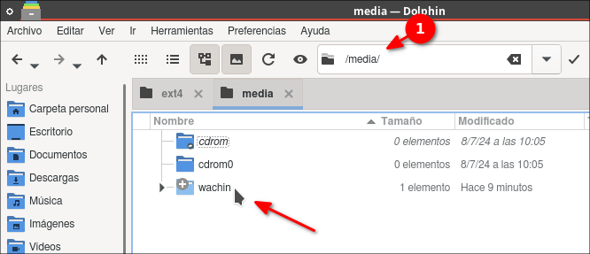
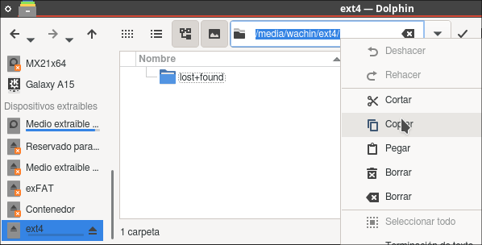

# Partition-Permission-Manager

Este tutorial explica cómo instalar y usar Partition Permission Manager, una herramienta gráfica para gestionar permisos de grupos y usuarios en particiones ext4 en sistemas Linux, especialmente útil para sistemas Debian/KDE.

## Requisitos Previos

1. Sistema operativo Linux (probado en Debian 12 de 32 bits)
2. Python 3.x instalado
3. Acceso a terminal y permisos de sudo

## Instalación

### 1. Instalar las dependencias necesarias

Abre una terminal y ejecuta:
```bash
sudo apt-get update
sudo apt-get install python3-tk git
```

### 2. Obtener el código

Hay dos formas de obtener el código:

#### Opción A: Clonar el repositorio (recomendado)
```bash
git clone https://github.com/wachin/Partition-Permission-Manager
cd Partition-Permission-Manager
```

#### Opción B: Descargar directamente
1. Visita https://github.com/wachin/Partition-Permission-Manager
2. Haz clic en el botón verde "Code"
3. Selecciona "Download ZIP"
4. Descomprime el archivo descargado
5. Abre una terminal en la carpeta descomprimida

### 3. Ejecutar el programa

Desde la terminal, dentro de la carpeta del proyecto, ejecuta:
```bash
python3 KDE_TK_Group_Manager.py
```

## Uso del Programa

El siguiente uso que le voy a dar porque he creado un Linux desde cero instalando Debian 12 Netinstall CD y he instalado el entorno de KDE pero no completo sino solo para usar los programas como Dolphin, Kate, K3B, y otros, o sea no he instalado los paquetes del entorno de escritorio de KDE. Y necesito crear un grupo y allí añadir mi usuario para poder gestionar el permiso para acceder a una particion ext4 de un disco duro externo, pero no deseo instalar: gnome-system-tools como lo explico en un [tutorial](https://facilitarelsoftwarelibre.blogspot.com/2022/09/como-dar-acceso-una-particion-para.html), así que esta es la solución:


El programa tiene tres secciones principales:

### 1. Manage Groups (Gestión de Grupos)
- **Group Name**: Ingresa el nombre del nuevo grupo que deseas crear
- **Create Group**: Al hacer clic, te pedirá tu contraseña de administrador y creará el grupo
- La lista debajo mostrará el grupo creado (también se pueden crear varios)

### 2. Manage Users (Gestión de Usuarios)
- **Username**: Escribe el nombre del usuario que deseas agregar al grupo. Si no sabes cuál es el nombre del usuario, vea en la terminal de Linux el nombre que está a la izquierda de la arroba ese es el nombre de usuario (y lo que está a la derecha de la arroba es el nombre de la máquina)
- **Add to Group**: Haz clic para agregar el usuario 

### 3. Manage Partition (Gestión de Particiones)
- **Partition Path**: Ingresa la ruta completa de la partición (ejemplo: /media/usuario/datos)
- **Set Permissions**: Establece los permisos de lectura y escritura para el grupo seleccionado

## Ejemplo de Uso para Dar permisos a una partición ext4 en un Disco Duro Externo

El siguiente es mi Disco Duro Toshiba visto en Gparted:


**Proceso para reducir espacio en HDD**
A mi HDD yo con Gparted le reduje espacio, al estar conectado el HDD y abrir Gparted, si usted había entrado desde el Administrador de Archivos a revisar algún archivo entonces estará montado, pero se puede desmontar en Gparted seleccionado la partición y clic en "Desmontar" así:


y clic derecho en "Redimensionar/Mover:


 y lo dejé con 286 GB" y le puse la etiqueta ext4
Si no le puso la etiqueta se la puede poner después (debe estar desmontada la partición):
 


pero después de crear la partición ext4 dentro del HDD no tengo acceso a crear ningún archivo en el Administrador de archivos:


para solucionarlo:

1. **Manage Groups** Crear un nuevo grupo
   - Escribe "allusers" en "Group Name"
   - Haz clic en "Create Group"
   - Ingresa tu contraseña de administrador cuando se solicite
   
debe quedar así:


2. **Manage Users** Agregar un usuario al grupo
   - Selecciona "allusers" de la lista de grupos
   - Escribe el nombre de usuario en "Username"
   - Haz clic en "Add to Group"
   - Ingresa tu contraseña cuando se solicite

3. **Manage Partitions** Establecer permisos en una partición
   - Selecciona "allusers" de la lista de grupos
   - Ingresa la ruta de la partición (ejemplo: /media/tuusuario/tuparticion)

Para hacer esto en el Administrador de archivos la partición debe estar montada:


usar el atajo:

Ctrl + L

y escribir la ruta:

/media/

dar Enter y allí dar clic en su usuario:



en mi caso miusuario es wachin, allí doy doble clic y entro en mi partición:


y allí copio la ruta, la muestro con "Ctrl + L" y la copio:
 


esa ruta hay que ponerla en el programa, peguela con "Ctrl + V":


   - Haz clic en "Set Permissions"
   - Ingresa tu contraseña cuando se solicite
   - Reinicia el ordenador
   - Cuando entres otra vez ya tendrás acceso a la particón ext4 del Disco Duro Externo

## Explicación del Código

El programa está construido usando Python y Tkinter, y realiza las siguientes funciones:

### Componentes Principales

1. **Interfaz Gráfica**:
   - Utiliza Tkinter para crear una interfaz de usuario intuitiva
   - Organiza los elementos en tres marcos (LabelFrames) para mejor organización
   - Implementa una lista para mostrar los grupos creados

2. **Gestión de Privilegios**:
   - Usa `simpledialog` para solicitar la contraseña de manera segura
   - Implementa `sudo` para ejecutar comandos que requieren privilegios de administrador
   - Oculta la contraseña usando asteriscos al escribir

3. **Comandos del Sistema**:
   - `groupadd`: Crea nuevos grupos en el sistema
   - `usermod`: Modifica la pertenencia a grupos de los usuarios
   - `chown`: Cambia el propietario de archivos y directorios
   - `chmod`: Modifica los permisos de archivos y directorios

### Funciones Principales

1. **create_group()**:
   - Obtiene el nombre del grupo desde el campo de entrada
   - Solicita la contraseña de administrador
   - Ejecuta el comando para crear el grupo
   - Actualiza la lista de grupos en la interfaz

2. **add_user_to_group()**:
   - Obtiene el usuario y el grupo seleccionado
   - Solicita la contraseña de administrador
   - Agrega el usuario al grupo especificado

3. **set_permissions()**:
   - Obtiene la ruta de la partición y el grupo seleccionado
   - Solicita la contraseña de administrador
   - Establece los permisos de grupo en la partición

## Notas de Seguridad

- Las contraseñas nunca se muestran en pantalla
- Los comandos sudo se ejecutan de manera segura
- Las contraseñas no se almacenan en el programa

## Solución de Problemas

1. Si aparece "sudo: a password is required":
   - Asegúrate de ingresar la contraseña correcta
   - Verifica que tu usuario tenga permisos de sudo

2. Si no puedes seleccionar un grupo:
   - Asegúrate de crear al menos un grupo primero
   - Haz clic en el grupo en la lista antes de realizar acciones

3. Si los permisos no se aplican:
   - Verifica que la ruta de la partición sea correcta
   - Asegúrate de que la partición esté montada
   - Comprueba que el sistema de archivos sea ext4
   
Dios te bendiga